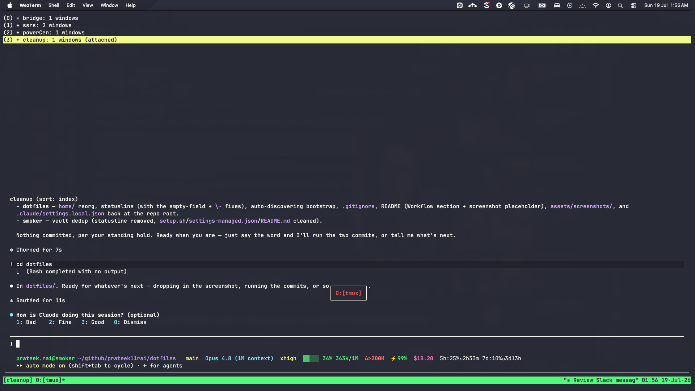

# dotfiles

Personal terminal dotfiles — cross-platform configs, with a macOS bootstrap. Everything under `home/` (zsh, tmux, WezTerm, Starship, …) works anywhere those tools run; only `scripts/mac-bootstrap.sh` (Homebrew installs + symlinking) is macOS-specific. On Linux, symlink `home/` into `$HOME` yourself and install the tools your way.


<!-- Screenshots live under assets/screenshots/ — drop workflow.png there. -->

## Workflow

Deliberately **session-centric and minimal**:

- **WezTerm is just a clean window** — no tab bar, minimal decorations (`enable_tab_bar = false`, `window_decorations = "RESIZE"`). It's only a surface; tmux does the multiplexing.
- **tmux is the driver.** One session per project/context, usually a single window each — I move between them with the built-in **session switcher** (`prefix + s`) rather than juggling windows or tabs. Prefix is remapped to `Ctrl-a`.
- **Named sessions, fast:** `prefix + N` prompts for a name and creates the session in one step; `prefix + S` renames the current session; `prefix + s` switches. `prefix + X` kills a session and drops you into another instead of back to a bare shell (`detach-on-destroy no-detached`).
- **Sessions survive reboots** — `resurrect` + `continuum` auto-save every 15 min and auto-restore on launch, so everything is where I left it.

The terminal stays chrome-free on purpose: the tmux session name and the Claude statusline already carry the context, so nothing sits on screen that a keystroke can't summon.

## Quick start

```sh
git clone git@github.com:prateek11rai/dotfiles.git ~/github/prateek11rai/dotfiles
~/github/prateek11rai/dotfiles/scripts/mac-bootstrap.sh
```

Before symlinking, the script moves any existing real file at the target
to `<target>.backup.<YYYYMMDD-HHMMSS>` so prior configs aren't lost.
Existing symlinks are replaced silently.

## Layout

```
home/      mirrors $HOME — every file here is symlinked into place
scripts/   run, never symlinked (mac-bootstrap.sh)
assets/    referenced, never symlinked (wallpapers, …)
```

The bootstrap walks `home/` and links each file to the matching path under
`$HOME`, so adding a config is just dropping it into `home/` — no bootstrap edit
needed. `.claude/` is special-cased: the statusline links only when the `claude`
CLI is present, its `statusLine` setting is merged into `settings.json`
rather than symlinked (Claude Code owns that file).

## What's included

| Tool | Config | Bootstrapped |
|------|--------|--------------|
| WezTerm | `~/.config/wezterm/wezterm.lua` | `brew install --cask wezterm` |
| Tmux | `~/.config/tmux/tmux.conf` | `brew install tmux` + tpm & plugins |
| Starship | `~/.config/starship.toml` | `brew install starship` |
| Fastfetch | `~/.config/fastfetch/` | `brew install fastfetch` |
| Zsh | `~/.zshrc` | Comes with macOS |
| zsh-autosuggestions | sourced in `.zshrc` | `brew install zsh-autosuggestions` |
| pyenv | sourced in `.zshrc` | `brew install pyenv` |
| JetBrains Mono | — | `brew install --cask font-jetbrains-mono` |
| gh (GitHub CLI) | — | `brew install gh` |
| Claude statusline | `~/.claude/statusline-command.sh` | symlink + `statusLine` merged into `settings.json` (only when `claude` is installed; needs `jq`) |

## Claude Code statusline

`~/.claude/statusline-command.sh` is a responsive status line for [Claude Code](https://claude.com/claude-code). It shows the model, reasoning effort, context-window usage, a long-context (`>200K`) premium warning, prompt-cache hit rate, session cost, and 5h/7d rate-limit usage with reset countdowns — collapsing to two rows and shedding segments in narrow panes.

The bootstrap wires it up **only if the `claude` CLI is installed**: it symlinks the script into `~/.claude/`, then adds a `statusLine` entry to `~/.claude/settings.json` **only if one isn't already set** (it never overwrites a customized one).

Why the setting is *merged* rather than symlinked like everything else: Claude Code owns `settings.json` and rewrites it at runtime (permission grants, `/config`), so it can't be a static linked file. The merge uses `jq` (installed by the bootstrap). To set it up by hand instead:

```json
{
  "statusLine": { "type": "command", "command": "bash ~/.claude/statusline-command.sh" }
}
```

## Claude Code skills

Skills don't live here. They're kept in their own folder and published to Atlan
workspaces, which install them into every agent.

## Theme

We use **Dracula** everywhere. Visit [draculatheme.com](https://draculatheme.com/) for manual setup in apps like Firefox, VS Code, YouTube, etc.

If you find something that can be automated (config file, brew install, script), add it to the bootstrap or dotfiles here for future use.

## License

[MIT](LICENSE) © Prateek Rai. Bundled third-party assets keep their own license — see [`assets/wallpapers/`](assets/wallpapers/README.md).
